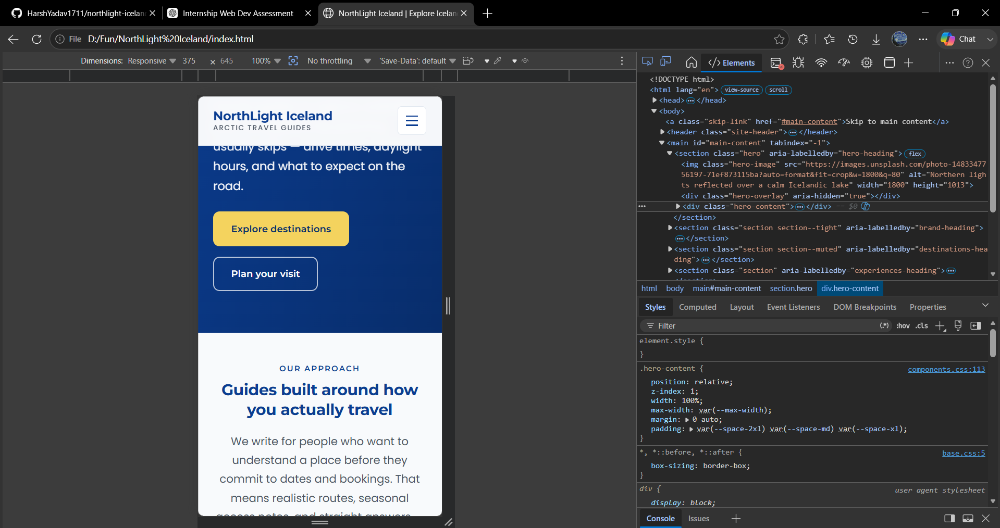
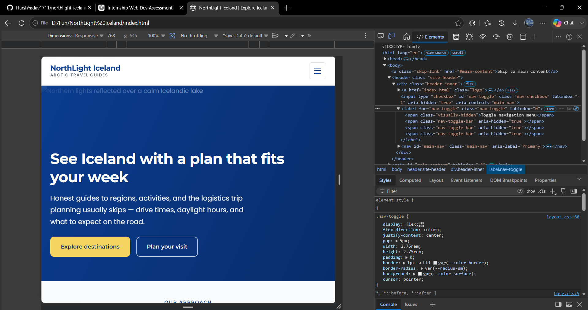
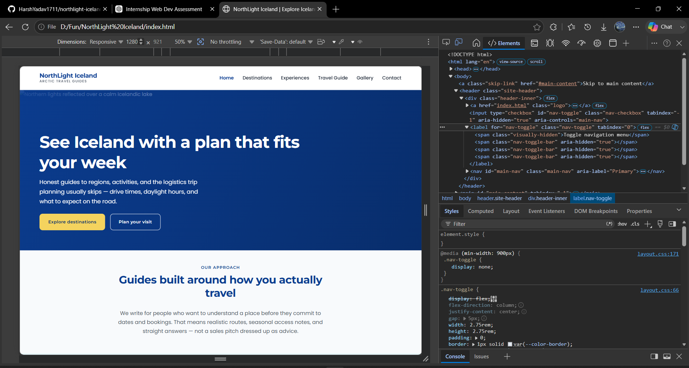

# NorthLight Iceland — Evaluation Report

**Document version:** 2.4 (final submission)  
**Date:** June 2026  
**Last updated:** 7 June 2026 — responsive evidence figures embedded in § A.6  
**Live URL:** https://harshyadav1711.github.io/northlight-iceland/

---

## Status at submission

| Category | Status | Evidence |
|----------|--------|----------|
| Development review (markup, accessibility intent, remediations) | **Completed** | [Part A](#part-a--completed-findings) |
| Automated HTML lint (`html-validate`) | **Completed** — 0 errors on all 8 HTML files | CLI run; no screenshot |
| W3C Nu HTML Validator | **Partial** — `index.html` and `contact.html` pass with 0 errors; six pages not yet uploaded | `html validation.png`, `html-validation-contact.png` |
| W3C CSS Validator | **Completed** — 0 errors; 4 warnings | `css validation.png` |
| WAVE accessibility evaluation | **Completed** — 3 pages; 0 errors and 0 contrast errors each | `wave-home.png`, `wave-destinations.png`, `wave-contact.png` |
| Cross-browser manual testing | **Partial** — Chrome and Edge captured; Firefox not recorded | `Chrome evidence.png`, `Edge evidence.png` |
| Responsive layout manual testing | **Completed** — primary breakpoints at 375px, 768px, and 1280px | `responsive-mobile-375.png`, `responsive-tablet-768.png`, `responsive-desktop-1280.png` |
| Evidence folder | **14 screenshots** on file | See [Part C](#part-c--evidence-inventory) |

---

## Evaluation scope

**Public pages (7):** `index.html`, `destinations.html`, `experiences.html`, `travel-guide.html`, `gallery.html`, `contact.html`, `thank-you.html`

**Development shell (1):** `template.html`

**Shared stylesheet:** `css/styles.css` (imports `tokens.css`, `base.css`, `layout.css`, `components.css`)

Cross-reference: submission sign-off in `SUBMISSION-REVIEW.md`. Screenshot guide in `docs/evidence/README.md`.

---

## Part A — Completed findings

### A.1 Automated markup review

| Check | Tool | Scope | Result |
|-------|------|-------|--------|
| HTML structure and validity rules | [`html-validate`](https://html-validate.org/) CLI | All 8 `.html` files at repository root | **Pass — 0 errors** |

Re-run locally:

```bash
npx html-validate "*.html"
```

**Result:** No issues found.

### A.2 W3C Nu HTML Validator (supplementary)

**Tool:** https://validator.w3.org/nu/

| Page | Errors | Warnings | Evidence | Result |
|------|--------|----------|----------|--------|
| `index.html` | 0 | 0 | `docs/evidence/html validation.png` | **Pass** — after `aria-controls` fix (see [B.1](#b1-issues-found-during-testing-remediated)) |
| `contact.html` | 0 | 0 | `docs/evidence/html-validation-contact.png` | **Pass** — no issues found |
| `destinations.html` | — | — | — | Not yet validated in Nu Validator |
| `experiences.html` | — | — | — | Not yet validated in Nu Validator |
| `travel-guide.html` | — | — | — | Not yet validated in Nu Validator |
| `gallery.html` | — | — | — | Not yet validated in Nu Validator |
| `thank-you.html` | — | — | — | Not yet validated in Nu Validator |
| `template.html` | — | — | — | Not yet validated in Nu Validator |

### A.3 W3C CSS Validator

**Tool:** https://jigsaw.w3.org/css-validator/  
**File tested:** `css/styles.css`  
**Evidence:** `docs/evidence/css validation.png`

| Errors | Warnings | Result |
|--------|----------|--------|
| 0 | 4 | **Pass** — no CSS errors; four warnings reported by the validator (review full output in screenshot; warnings are non-blocking) |

### A.4 WAVE accessibility evaluation

**Tool:** https://wave.webaim.org/  
**Target:** Live site URLs

| Page | Errors | Contrast errors | Alerts | AIM score | Evidence | Result |
|------|--------|-----------------|--------|-----------|----------|--------|
| `index.html` | 0 | 0 | 2 | 10/10 | `wave-home.png` | **Pass** — no errors; alerts noted in [B.2](#b2-issues-noted--not-remediated-accepted) |
| `destinations.html` | 0 | 0 | 2 | 10/10 | `wave-destinations.png` | **Pass** — no errors; same alert types as homepage |
| `contact.html` | 0 | 0 | 2 | 10/10 | `wave-contact.png` | **Pass** — no errors; same alert types as homepage |

**WAVE alert detail (all three pages — not remediated; manual review):**

| Alert | Count | Likely cause | Action |
|-------|-------|--------------|--------|
| Possible heading | 1 | Text styled as heading without `<h1>`–`<h6>` (often logo tagline or similar) | Review manually; change only if a true heading is intended |
| Redundant link | 1 | Logo and adjacent “Home” nav link share `index.html` | Common pattern; acceptable for submission |

**Result:** No WAVE errors or contrast errors on tested pages.

### A.5 Cross-browser manual testing

| Browser | Viewport | Page | Evidence | Result |
|---------|----------|------|----------|--------|
| Google Chrome | Desktop | `index.html` | `Chrome evidence.png` | **Pass** — layout, navigation, and typography render; Unsplash hero image requires network (broken `alt` placeholder visible under `file://` without CDN) |
| Microsoft Edge | Desktop | `index.html` | `Edge evidence.png` | **Pass** — layout and navigation consistent with Chrome |
| Mozilla Firefox | — | — | — | **Not recorded** — no screenshot on file |

### A.6 Responsive layout manual testing

**Method:** Chrome / Edge DevTools responsive mode. Primary evidence uses the canonical filenames in `docs/evidence/README.md`.

#### Primary breakpoint evidence

| Breakpoint | Viewport | Page tested | Evidence file | Observed behaviour | Result |
|------------|----------|-------------|---------------|-------------------|--------|
| Mobile | 375 × 645px | `index.html` | `responsive-mobile-375.png` | Single column; hero call-to-action buttons stack; “Our approach” section readable below fold (header and hamburger above captured viewport) | **Pass** |
| Tablet | 768 × 645px | `index.html` | `responsive-tablet-768.png` | Hamburger menu still shown (horizontal nav activates at 900px); full hero heading and body copy readable; CTA buttons side by side | **Pass** |
| Desktop | 1280 × 921px | `index.html` | `responsive-desktop-1280.png` | Full horizontal primary navigation; mobile toggle hidden (`display: none` at ≥900px); hero and “Our approach” sections render as intended | **Pass** |

#### Evidence figures — primary breakpoints

Screenshots captured in Chrome DevTools responsive mode against local `index.html` (viewport dimensions shown in each image).

**Figure 1 — Mobile (375 × 645px)**



*Pass — narrow single-column layout; hero call-to-action buttons stack vertically; “Our approach” section readable without horizontal scroll (site header and hamburger menu sit above this viewport crop).*

**Figure 2 — Tablet (768 × 645px)**



*Pass — hamburger menu still shown (horizontal nav activates at 900px); hero heading and body copy fully readable; call-to-action buttons display inline.*

**Figure 3 — Desktop (1280 × 921px)**



*Pass — horizontal navigation bar replaces the mobile toggle; hero and “Our approach” sections render as intended; DevTools confirms `.nav-toggle { display: none }` at ≥900px.*

#### Responsive test matrix (homepage — verified from primary evidence)

| Test | Mobile (375px) | Tablet (768px) | Desktop (1280px) |
|------|----------------|----------------|------------------|
| Navigation usable | Pass — hamburger visible | Pass — hamburger visible | Pass — horizontal nav bar |
| Hero / page hero readable | Pass | Pass | Pass |
| Call-to-action buttons usable | Pass — stacked | Pass — inline pair | Pass — inline pair |
| Content sections below hero readable | Pass — “Our approach” visible | Pass — hero fills viewport | Pass — hero + “Our approach” visible |
| Card grid layout | Not in viewport | Not in viewport | Not in viewport |
| Tables scroll horizontally | N/A on homepage | N/A on homepage | N/A on homepage |
| Contact form usable | N/A on homepage | N/A on homepage | N/A on homepage |
| Footer readable | Not in viewport | Not in viewport | Not in viewport |

**Result:** No responsive layout issues found on `index.html` at the three primary breakpoints. Card grids, tables, and the contact form were not exercised in these homepage captures.

#### Supplementary mobile device captures

Additional narrow-width checks on `index.html` (same page; non-canonical filenames):

| Device | Approx. width | Evidence file | Result |
|--------|---------------|---------------|--------|
| iPhone SE | 375px | `iPhone SE Evidence.png` | **Pass** — consistent with `responsive-mobile-375.png` |
| Samsung Galaxy S8+ | 360px | `Samsung Galaxy S8+ Evidence.png` | **Pass** |
| Galaxy Z Fold 5 | 344px | `Galaxy Z Fold 5 Evidence.png` | **Pass** |

**Not yet captured:** responsive screenshots of inner pages (`destinations.html` at 768px, `travel-guide.html` at 1280px) for card grids, tables, and form layout.

### A.7 CSS structure review

| Check | Result |
|-------|--------|
| Layered imports via `css/styles.css` | **Pass** |
| Invalid properties in stylesheets | **Pass** |
| Responsive breakpoints in use | **Pass** — 600px, 768px, 900px |

**Result:** No issues found.

### A.8 Implemented accessibility features

| Feature | Implementation |
|---------|----------------|
| Skip link | Present on all pages |
| Page language | `lang="en"` on `<html>` |
| Headings | One `<h1>` per page; logical `h2` / `h3` hierarchy |
| Alt text | Descriptive `alt` on all content images |
| Form labels | Explicit `<label>` associations; hints via `aria-describedby` |
| Colour contrast | Dark text on light surfaces; breadcrumb and footer link opacity raised during review |
| Focus indicators | Visible `:focus-visible` outline on interactive elements |
| Tables | `<caption>` and `th scope` on all data tables |
| Motion | `prefers-reduced-motion` respected for navigation animation and form transitions |
| Navigation toggle | Hidden checkbox (`tabindex="-1"`, `aria-hidden="true"`, `aria-controls="main-nav"`); visible label (`tabindex="0"`) |
| Screen reader utility | `.visually-hidden` and `.nav-checkbox` use `clip-path: inset(50%)` |

---

## Part B — Issues found and fixes

### B.1 Issues found during testing (remediated)

| # | Issue | Found by | Area | Fix applied |
|---|-------|----------|------|-------------|
| 1 | `aria-controls` on `<label for="nav-toggle">` — invalid per HTML | W3C Nu Validator (`index.html`) | Navigation (all 8 pages) | Moved `aria-controls="main-nav"` to checkbox input; label keeps `tabindex="0"` |
| 2 | Duplicate complementary landmarks without unique labels | Development / `html-validate` | `contact.html` | Both `<aside>` elements named with `aria-labelledby` |
| 3 | Redundant `for` on nested consent checkbox label | Development review | `contact.html` | Redundant `for` removed |
| 4 | Hidden checkbox in tab order | Development review | Navigation (all pages) | `tabindex="-1"` and `aria-hidden="true"` on checkbox; label receives focus |
| 5 | Deprecated `clip: rect()` in visually-hidden utility | Development review | `css/base.css` | Removed; `clip-path: inset(50%)` only |
| 6 | Redundant `aria-required` alongside native `required` | Development review | `contact.html` | Redundant attribute removed |
| 7 | Low-contrast breadcrumb links on page hero | Development review | Inner pages | Opacity increased to 88% |
| 8 | Low-contrast footer links | Development review | All pages | High-contrast white link colours |
| 9 | Wide tables on small screens | Development review | Table pages | `.table-wrap` with horizontal scroll |

**Evidence for issue 1:** `html validation.png` shows **0 errors** on `index.html` after the fix. `html-validation-contact.png` confirms **0 errors** on `contact.html` (same navigation pattern).

### B.2 Issues noted — not remediated (accepted)

| Issue | Found by | Detail | Status |
|-------|----------|--------|--------|
| Mobile menu `aria-expanded` not updated | Design constraint | CSS-only toggle; no JavaScript | **Known limitation** |
| WAVE “Possible heading” alert | WAVE (3 pages) | 1 alert per page; likely non-semantic styled text | **Accepted** — manual review; no error |
| WAVE “Redundant link” alert | WAVE (3 pages) | Logo + “Home” nav both link to `index.html` | **Accepted** — common header pattern |
| W3C CSS 4 warnings | W3C CSS Validator | Non-blocking warnings on `styles.css` | **Accepted** — 0 errors; see `css validation.png` |
| CDN images offline under `file://` | Chrome evidence | Hero Unsplash image shows broken icon without network | **Expected** — site designed for HTTP + CDN |
| Demo form `method="get"` | By design | Field values appear in URL on submit | **Known limitation** |

### B.3 Checks with no issues found

| Check | Tool / method | Scope | Result |
|-------|---------------|-------|--------|
| HTML lint | `html-validate` CLI | All 8 HTML files | 0 errors |
| W3C Nu HTML validation | Nu Validator | `index.html` | 0 errors, 0 warnings |
| W3C Nu HTML validation | Nu Validator | `contact.html` | 0 errors, 0 warnings |
| W3C CSS validation | CSS Validator | `css/styles.css` | 0 errors |
| WAVE errors | WAVE | `index.html`, `destinations.html`, `contact.html` | 0 errors, 0 contrast errors on each |
| Chrome desktop layout | Manual | `index.html` | Renders correctly |
| Edge desktop layout | Manual | `index.html` | Renders correctly |
| Mobile responsive layout | DevTools — `responsive-mobile-375.png` | `index.html` at 375px | Pass — single column, hamburger menu |
| Tablet responsive layout | DevTools — `responsive-tablet-768.png` | `index.html` at 768px | Pass — hamburger menu; hero readable |
| Desktop responsive layout | DevTools — `responsive-desktop-1280.png` | `index.html` at 1280px | Pass — horizontal navigation |
| Narrow mobile layouts | DevTools — supplementary captures | `index.html` at 344–375px | Pass — three additional device presets |

### B.4 Checks not yet completed

| Check | Status |
|-------|--------|
| W3C Nu Validator on six remaining HTML pages | Not uploaded / not screenshot |
| Mozilla Firefox manual test | No evidence on file |
| Contact form validation screenshot in Edge | Not captured (`Edge evidence.png` shows homepage only) |
| Inner-page responsive spot-checks (`destinations.html` at 768px, `travel-guide.html` at 1280px) | Not captured — primary breakpoint evidence uses `index.html` |

---

## Part C — Evidence inventory

Files present in `docs/evidence/` as of 7 June 2026:

| File | Test type | Documents |
|------|-----------|-----------|
| `html validation.png` | W3C Nu Validator — `index.html` | 0 errors, 0 warnings |
| `html-validation-contact.png` | W3C Nu Validator — `contact.html` | 0 errors, 0 warnings |
| `css validation.png` | W3C CSS Validator — `styles.css` | 0 errors, 4 warnings |
| `wave-home.png` | WAVE — homepage | 0 errors, 0 contrast errors, 2 alerts |
| `wave-destinations.png` | WAVE — destinations page | 0 errors, 0 contrast errors, 2 alerts |
| `wave-contact.png` | WAVE — contact page | 0 errors, 0 contrast errors, 2 alerts |
| `responsive-mobile-375.png` | Responsive — 375×645 | `index.html` mobile; hamburger, stacked CTAs |
| `responsive-tablet-768.png` | Responsive — 768×645 | `index.html` tablet; hamburger, full hero |
| `responsive-desktop-1280.png` | Responsive — 1280×921 | `index.html` desktop; horizontal nav |
| `Chrome evidence.png` | Cross-browser — Chrome desktop | Homepage layout |
| `Edge evidence.png` | Cross-browser — Edge desktop | Homepage layout |
| `iPhone SE Evidence.png` | Responsive — supplementary 375px | Homepage mobile |
| `Samsung Galaxy S8+ Evidence.png` | Responsive — supplementary 360px | Homepage mobile |
| `Galaxy Z Fold 5 Evidence.png` | Responsive — supplementary 344px | Homepage mobile |
| `README.md` | Capture guide | Filename reference for assessors |

**Note:** Primary responsive evidence (`responsive-*.png`) captures `index.html` at all three breakpoints. The evidence guide originally suggested `destinations.html` (tablet) and `travel-guide.html` (desktop) for card-grid and multi-column checks; those inner-page captures remain optional.

**Still missing (optional):** Firefox screenshot, Edge contact-form validation screenshot, inner-page responsive shots, Nu Validator screenshots for remaining HTML pages.

---

## Part D — Known limitations (accepted for submission)

- Contact form uses `method="get"` and redirects to `thank-you.html`; no server-side processing.
- Photographs load from the Unsplash CDN; offline or `file://` viewing may show `alt` text until images load.
- CSS-only mobile menu does not update `aria-expanded` when toggled.
- WAVE reports two non-error alerts per tested page (possible heading, redundant link).
- Six HTML pages not yet checked in the W3C Nu Validator; Firefox not manually tested.

---

## Conclusion

NorthLight Iceland has been evaluated with a mix of **automated tools**, **manual browser checks**, and **filed evidence screenshots**. **No blocking defects** were found in completed checks: `html-validate` reports zero errors, W3C Nu Validator passes `index.html` and `contact.html`, W3C CSS Validator reports zero errors on `styles.css`, and WAVE reports zero errors and zero contrast errors on three representative pages.

One **HTML validation error** (`aria-controls` on the navigation `<label>`) was found during Nu Validator testing and **fixed** across all eight HTML files; post-fix evidence confirms a clean result on `index.html`.

Primary **responsive breakpoint evidence** (375px, 768px, 1280px on `index.html`) is complete. Remaining gaps are **documentation completeness** (six pages not Nu-validated, Firefox not tested, inner-page responsive spot-checks) rather than known code failures. See [Part B.4](#b4-checks-not-yet-completed) for the open checklist.

For submission sign-off, see `SUBMISSION-REVIEW.md`.
